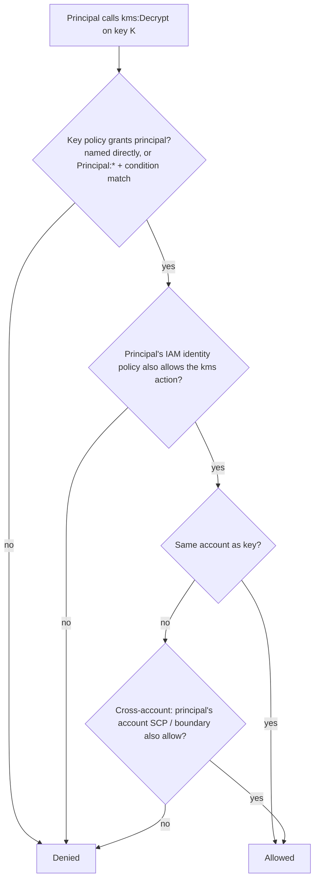

# KMS Key Policy Evaluation

Relevant when an S3 bucket is encrypted with a **customer-managed CMK** (SSE-KMS with a CMK).
With SSE-S3 or `aws/s3`, KMS is not a separate gate for the caller. With a CMK, the caller's
IAM role needs direct KMS permissions *and* the key policy must allow it.

(DynamoDB CMK encryption works differently — DynamoDB uses the key on your behalf, so callers
normally don't need direct `kms:Decrypt` grants. The rules below apply when any service
accesses KMS directly.)

## S3 encryption flavors

| Bucket encryption | KMS a caller gate? | Extra requirement |
|---|---|---|
| **SSE-S3** (AES-256, S3-managed) | No | None. |
| **SSE-KMS `aws/s3`** (AWS-managed) | Auto-grants the bucket's account | None same-account. **Cross-account impossible** — use a CMK. |
| **SSE-KMS CMK** (customer-managed) | Yes | **Key policy must explicitly allow the principal** for `Encrypt`/`Decrypt`/`GenerateDataKey`. Deny-by-default. |

## KMS is deny-by-default

"Same account" gives you nothing for free — the key policy is the gate. Two ways an account
expresses "my key, allow access":

| Pattern | Key policy says | Net effect |
|---|---|---|
| **Root-delegation** (AWS default key policy) | `Allow, Principal: arn:aws:iam::<acct>:root, Action: kms:*` | Delegates to IAM. Any principal in `<acct>` whose IAM allows `kms:*` can use the key. New roles = IAM-only change. |
| **Explicit enumeration** | Each consuming principal named directly, or `Principal: "*"` + a condition on `aws:PrincipalArn` / `aws:PrincipalTag` / `aws:PrincipalOrgPaths` | No delegation. **IAM alone never suffices** — the principal must be named or condition-matched. New role = key policy edit. |

A `:root` statement that only grants read-only metadata (`Describe*`/`List*`/`Get*`) does
**not** delegate `Encrypt`/`Decrypt` to IAM — check what actions the root statement actually
covers before assuming delegation.

### Condition-based enumeration shapes

Both are **explicit grants** as far as KMS is concerned. `Principal: "*"` is not "allow
anyone" — the conditions scope it.

```json
{
  "Effect": "Allow",
  "Principal": { "AWS": "*" },
  "Action": ["kms:Decrypt", "kms:DescribeKey"],
  "Resource": "*",
  "Condition": {
    "StringLike": { "aws:PrincipalArn": "arn:aws:iam::111122223333:role/app/MyRole-*" }
  }
}
```

```json
{
  "Effect": "Allow",
  "Principal": { "AWS": "*" },
  "Action": ["kms:Decrypt", "kms:Encrypt", "kms:GenerateDataKey"],
  "Resource": "*",
  "Condition": {
    "StringEquals": { "aws:PrincipalTag/service_id": "my-service" },
    "ForAnyValue:StringLike": { "aws:PrincipalOrgPaths": "o-xxxx/*/ou-yyyy/*" }
  }
}
```

## KMS decision walk



**Operational consequence:** with explicit-enumeration key policies, every new role that uses
a CMK requires the key owner to add a key-policy entry. There is no "inherited from IAM"
shortcut — same-account or cross-account alike.
